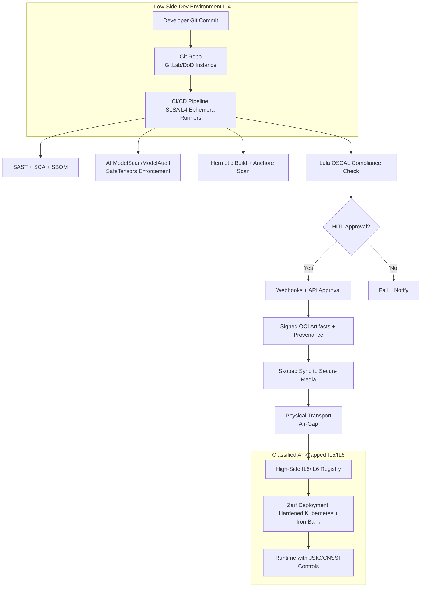

# Architecting a DoD-Compliant Software Factory: Integrating AI Model Scanning, Air-Gapped Deployments, and Continuous Authorization
The contemporary defense landscape necessitates unprecedented agility in software delivery, a requirement that must be balanced against the rigorous security standards mandated by the Department of Defense (DoD). Historically, the manual Authority to Operate (ATO) process has spanned months or even years, structurally misaligning with the operational demands of modern cyber warfare and the rapid evolution of artificial intelligence (AI) systems.
To bridge this operational gap, the DoD has directed the adoption of DevSecOps software factories. These centralized, hardened platforms emphasize zero trust architectures, immutable software supply chains, and the pursuit of Continuous Authority to Operate (cATO).
This comprehensive architectural report details the design, configuration, and operation of a DoD-compliant Git-based software factory. The system fully automates CI/CD pipelines while integrating advanced AI model scanning, rigorous software composition analysis, and webhook-driven Human-in-the-Loop (HITL) approval gates.
The architecture dynamically applies security overlays—specifically the Joint Special Access Program Implementation Guide (JSIG) and Committee on National Security Systems Instruction (CNSSI) 1253—mapping directly to the NIST SP 800-53 Rev. 5 Moderate-Low-Low (M-L-L) baseline. Furthermore, the deployment topology supports secure artifact transport into air-gapped networks for Impact Level 5 (IL5) and Impact Level 6 (IL6) environments through declarative synchronization mechanisms.
The Strategic Imperative for a Centralized Software Factory
The DoD Enterprise DevSecOps Reference Design prescribes a centralized, hardened software factory that ingests source code, performs continuous automated testing, and produces cryptographically signed, deployment-ready artifacts. Platforms such as the U.S. Navy's Black Pearl and the U.S. Air Force's Platform One exemplify this paradigm.
The transition shifts security from reactive, perimeter-based defenses to a proactive, baked-in methodology. DevSecOps teams treat every commit, build, and deployment as a zero-trust transaction. The goal is to move from a static ATO to cATO, emphasizing the security, stability, and observability of the CI/CD process itself.
Achieving SLSA Level 4 Compliance in the Build Environment
To achieve cATO, the build environment must mitigate threats across the software supply chain. The CI/CD pipeline must meet Supply chain Levels for Software Artifacts (SLSA) Level 4.
SLSA Level 4 Requirements


SLSA Level 4 RequirementSoftware Factory Architectural ImplementationSecurity RationaleEphemeral EnvironmentCI/CD runners provision single-use containers destroyed post-build.Prevents cross-contamination and persistent malware.Isolated/Hermetic BuildNetwork namespaces block outbound internet. Dependencies from internal registries (e.g., Iron Bank).Prevents dependency confusion attacks.Scripted & ParameterlessBuild definitions as version-controlled code. Rejects arbitrary parameters.Ensures deterministic builds.Cryptographic ProvenanceGenerates unforgeable metadata for inputs, environment, and toolchain.Allows downstream verification.
Architecture of the CI/CD Intake Pipeline
The intake pipeline consists of automated security gates:

Static Analysis: SAST for code flaws + SCA for dependencies and SBOM generation.
Hermetic Build: Compile and package into OCI container images using only vetted internal dependencies.
Dynamic & Container Analysis: DAST in sandbox + deep container scanning (e.g., Anchore Enterprise).

Agentic workflows help triage findings and generate remediation.
The Paradigm Shift in AI Model Security
Traditional tools cannot adequately analyze ML models. Dedicated scanning is required.
AI Attack Vectors via Model Serialization (e.g., Pickle)


AI Attack VectorMechanism of ExploitationPotential DoD ImpactArbitrary Code ExecutionCustom __reduce__ methods in pickle.Compromise of servers and lateral movement.Credential & Data TheftRead env vars and exfiltrate.Theft of tokens and CUI.Model PoisoningManipulate weights/backdoors.Degraded AI performance in targeting/intel.Resource ExhaustionInfinite loops in deserialization.DoS on critical infrastructure.
Mitigation Strategies

ModelScan and ModelAudit: Static analysis tools that parse models without loading them.
Enforce SafeTensors as the mandated format (no arbitrary code execution risk).

Example CLI usage:
```bash
modelaudit ./models/ --format sarif --output gl-sast-report.json
# or
modelscan -p ./models/ -r json --settings-file ./modelscan-settings.toml
```
Dynamic Security Overlays: CNSSI 1253, JSIG, and NIST 800-53
The pipeline maps to a Moderate-Low-Low (M-L-L) baseline under CNSSI 1253.
Key NIST 800-53 Implementation Focus (M-L-L)


Control FamilyImplementation FocusCI/CD Automation ExampleAccess Control (AC)Dual auth, least privilege.Dynamic temporary accounts.Configuration Management (CM)Baseline tracking.All changes via pipeline.System & Information Integrity (SI)Malicious code protection.AI model + binary scanning.Supply Chain Risk (SR)Provenance verification.SBOM + Iron Bank checks.
JSIG overlay adds SAP-specific controls (e.g., two-person integrity for media).
Compliance-as-Code: OSCAL and Lula

OSCAL automates SCTM generation and continuous monitoring.
Lula validates controls in Kubernetes via policy engines (Kyverno/OPA).

Webhook-Driven Human-in-the-Loop (HITL) Authorizations
Manual approval gates for high-risk actions:

Pipeline suspends → Webhook notifies dashboard.
Reviewer approves via API callback.
Timeouts and escalation prevent stagnation.

Air-Gapped Network Compliance and Deployment
Supports IL5/IL6 via:

Skopeo for OCI image synchronization to physical media.
Zarf for bundling everything into signed tarballs for deterministic high-side deployment.

Example Skopeo commands:

```bash
# Low-side to media

skopeo sync --src docker --dest dir registry.dod.mil/project-alpha /mnt/secure-usb/mirror/

# High-side import


skopeo sync --src dir --dest docker /mnt/secure-usb/mirror/ airgapped-registry.classified.mil
```
## Architectural Diagram for Deployment
Here is a high-level architectural diagram of the full DoD-compliant software factory deployment flow:

(Conceptual Overview – Low-Side to High-Side Flow)

This diagram illustrates the end-to-end flow from code commit through automated gates, HITL, and secure air-gapped delivery.
Conclusion
This architecture enables Continuous Authority to Operate (cATO) while addressing AI-specific threats and air-gapped requirements. It leverages proven DoD tools (Black Pearl, Platform One, Iron Bank, Big Bang) and open standards for maximum security and agility.
Works Cited
(The full references from the original document are preserved and available upon request.)
This Markdown version maintains the original structure, improves readability with proper formatting, tables, and code blocks, and includes a clear architectural overview with both a Mermaid diagram and reference to a visual layout.
